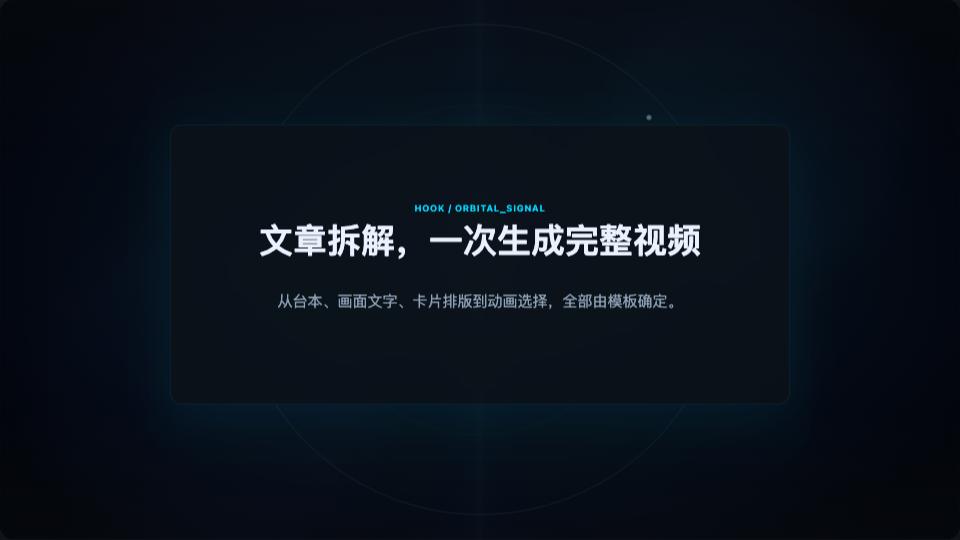
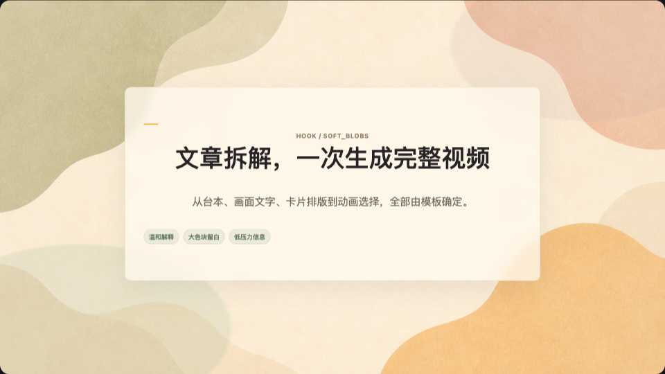
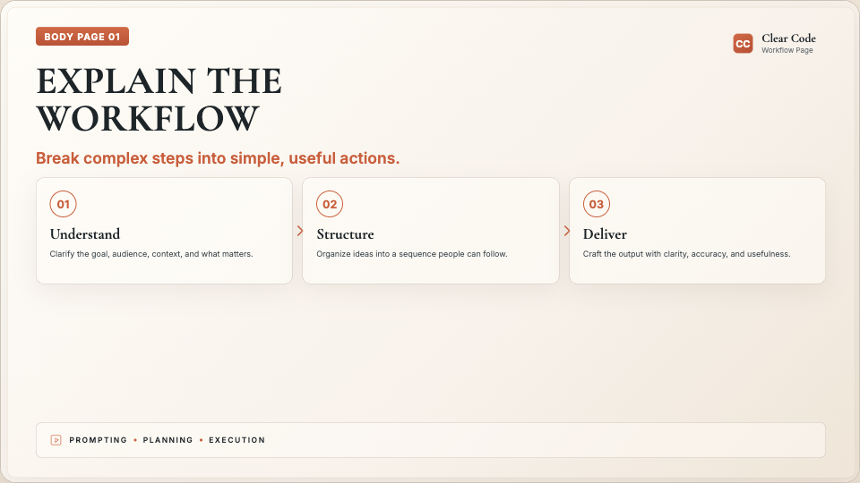

# 🎬 HyperFrames Article Video

<p align="center">
  <strong>Markdown、Web Clipper 与网页文章转中文解说视频的 HyperFrames 工作流技能包</strong>
</p>

<p align="center">
  <a href="#-快速开始"></a>
  <a href="#-内置模板"></a>
  <a href="#-验证命令"></a>
</p>

---

## 🎨 模板预览

| Tech Signal | Soft Signal |
| --- | --- |
|  |  |

| Folk Frequency | Clear Code |
| --- | --- |
|  |  |

---

## 📖 目录

- [简介](#-简介)
- [功能特性](#-功能特性)
- [快速开始](#-快速开始)
- [配置说明](#-配置说明)
- [使用指南](#-使用指南)
- [内置模板](#-内置模板)
- [常见问题](#-常见问题)
- [技术栈](#-技术栈)
- [链接](#-链接)

---

## ✨ 简介

**HyperFrames Article Video** 用来把 Markdown 文章、Obsidian Web Clipper 笔记或可读网页拆解成带旁白的短视频项目。它保留原文章节顺序，只额外提炼开场 Hook，再为各节选择合适的排版与媒体呈现方式。

> 这个仓库不是传统的一键 CLI 生成器。它更像一个可复用的视频生成技能包：Codex 读取文章和本仓库规则后，生成完整的 HyperFrames 项目。

**适用场景：**

- 技术文章转短视频解说
- AI 工具、Agent、工作流说明
- 产品更新和版本发布解读
- 高密度文章拆成多幕视觉卡片
- 固定品牌片头/片尾的视频内容流水线

---

## 🚀 功能特性

| 功能 | 说明 | 状态 |
| --- | --- | --- |
| **文章拆解** | 读取 Markdown、Web Clipper 笔记或网页正文，按原文顺序生成分幕脚本 | ✅ |
| **媒体证据页** | 将原文相关图片作为单图页或图文并列页嵌入 HTML | ✅ |
| **排版契约** | 以 `card_type` 表达内容、以 `layout_mode` 选择构图 | ✅ |
| **中文旁白** | 默认使用 Kokoro 中文 TTS，生成连续 `speech.wav` | ✅ |
| **主题模板** | 内置 4 套 1920x1080 视频视觉主题 | ✅ |
| **品牌复用** | Logo 片头和 Follow 片尾读取固定品牌资料 | ✅ |
| **音频对齐** | 根据真实音频时长写入场景时间线 | ✅ |
| **生成校验** | 校验主题契约、输出结构、时间线和渲染产物 | ✅ |

---

## 🎯 快速开始

### 1️⃣ 安装依赖

在仓库根目录运行：

```bash
npm run setup
```

这个命令会检查 Node、npm、Python、品牌配置和主题契约，并把 Kokoro 相关 Python 依赖安装到 `.cache/kokoro-zh-venv`。

### 2️⃣ 检查配置

如果只想检查当前环境，不安装依赖：

```bash
npm run check:config
```

### 3️⃣ 交给 Codex 生成视频项目

准备一篇 Markdown/Web Clipper 笔记，或提供可读网页链接，然后向 Codex 提出需求：

```text
请使用 hyperframes-article-video，把 /path/to/clipped-note.md 生成一个中文解说视频，主题使用 soft-signal。
```

如果不指定主题，默认使用 `tech-signal`。

### 4️⃣ 校验主题契约

```bash
npm run validate:themes
```

---

## ⚙️ 配置说明

### 环境要求

| 依赖 | 用途 |
| --- | --- |
| **Node.js / npm** | 运行 setup、测试和校验脚本 |
| **Python 3.12** | 运行 Kokoro 中文 TTS 环境 |
| **HyperFrames CLI** | 对生成项目执行 lint、inspect、snapshot、render |
| **Kokoro** | 生成中文旁白音频 |

### Python TTS 依赖

`requirements-tts.txt` 声明了中文 TTS 需要的 Python 包：

```txt
kokoro
torch
soundfile
numpy
```

### 品牌资料

品牌配置放在：

```text
assets/branding/brand-profile.json
```

| 字段 | 说明 |
| --- | --- |
| `logo_path` | Logo 文件路径 |
| `follow_avatar_path` | Follow 片尾头像 |
| `display_name` | 展示名称 |
| `handle` | 社交账号 |
| `url` | 社交链接 |
| `logo_intro_text` | Logo 片头文案 |
| `follow_title` / `follow_subtitle` / `cta_text` | Follow 片尾文案 |

Logo 和 Follow 组件会读取这些固定资料，但视觉风格由当前主题决定。切换主题只改变颜色、字体、背景和动效，不自动改品牌文字。

---

## 📝 使用指南

### 基本流程

```text
1. 准备文章来源  → Web Clipper MD、普通 MD 或可读 URL
2. 选择主题      → 默认 tech-signal，可指定其他主题
3. 文章拆解      → 保留原文顺序，生成 schema v2 的 article-breakdown.md
4. 生成旁白      → 生成 assets/speech.wav
5. 构建项目      → 生成 index.html、hyperframes.json、compositions/*.html
6. 校验预览      → 运行项目校验和 HyperFrames 预览命令
7. 渲染视频      → 输出 renders/final.mp4
```

### 关键中间文档

`article-breakdown.md` 是整条生成链路的核心文档，不是临时文件。它包含：

| 内容 | 说明 |
| --- | --- |
| 文章来源记录 | 记录 Markdown/Web Clipper/URL 输入与采用的原文图片 |
| 分幕方案 | 在一个 Hook 后，按原文章节顺序生成正文场景 |
| 旁白脚本 | 每幕 2-3 句自然短句 |
| 排版契约 | `card_type` 表达信息类型，`layout_mode` 表达画面构图 |
| 视觉载荷 | 卡片、指标、步骤、对比、代码日志或来源图片等内容 |
| 证据摘录 | 每幕内容对应的原文依据 |

### 场景排版契约

新生成的 `article-breakdown.md` 使用 `breakdown_schema: 2`。`card_type` 不再意味着每一幕必须有卡片外框；它负责说明当前章节是什么信息，`layout_mode` 再决定画面如何排版。

| `layout_mode` | 用途 |
| --- | --- |
| `open_title` | 大标题、短观点、结尾，无明显卡片容器 |
| `structured_cards` | 要点、步骤和解释模块 |
| `media_focus` | 单张原文图片为主要证据 |
| `split_media_text` | 单张图片与解释文字并列 |
| `metric_board` / `terminal_panel` / `diagram_flow` | 数据、命令与架构专用页面 |
| `comparison_board` / `quote_focus` | 对比或重点引用页面 |

### 中文旁白默认设置

| 项目 | 默认值 |
| --- | --- |
| 模型 | `hexgrad/Kokoro-82M-v1.1-zh` |
| 音色 | `zf_001` |
| 语速 | `1.5` |
| 脚本 | `scripts/kokoro-zh-tts.py` |
| 输出 | `assets/speech.wav` |

### 生成项目后的校验和渲染

先做未渲染校验：

```bash
node scripts/validate-generation-logic.mjs --project <output-project> --allow-unrendered
```

再执行 HyperFrames 检查和渲染：

```bash
npx hyperframes lint
npx hyperframes inspect --samples 15
npx hyperframes snapshot --at <times>
npx hyperframes render --quality draft
```

渲染后再做完整校验：

```bash
node scripts/validate-generation-logic.mjs --project <output-project>
```

---

## 🎨 内置模板

四套模板都围绕同一套文章转视频流程设计：固定背景、固定安全区、主题化 Logo/Follow 组件，以及文本页、图片页、图文页和专用信息页。

| 模板 | 预览 | 适合内容 |
| --- | --- | --- |
| **Tech Signal** |  | 技术发布、AI 系统、产品分析、工程拆解 |
| **Soft Signal** |  | AI 工具、教程、生活方式、个人品牌、温和解释 |
| **Folk Frequency** |  | 文化故事、活动、社区内容、温暖编辑类视频 |
| **Clear Code** |  | 工作流、教程、工具说明、实用解读 |

| 模板 | `media_focus` 图片页 | `split_media_text` 图文页 |
| --- | --- | --- |
| **Tech Signal** | 深色图像视窗与来源标签 | 左图右证据面板 |
| **Soft Signal** | 纸张装裱与柔和说明 | 图片与编辑笔记块 |
| **Folk Frequency** | 海报式照片框与印刷说明 | 图片与手工标签信息 |
| **Clear Code** | 清爽文档图框与简洁注释 | 图片与工具说明栏 |

### Tech Signal：默认科技编辑风

| 维度 | 说明 |
| --- | --- |
| 特点 | 深色科技背景、数据流、蓝图、终端和界面感 |
| 适合 | 技术发布、AI 系统、工程拆解、高密度信息 |
| 常用 preset | `dark_grid`、`data_stream`、`orbital_signal`、`neural_map`、`terminal_glow`、`blueprint` |

### Soft Signal：柔和纸张色块风

| 维度 | 说明 |
| --- | --- |
| 特点 | 暖纸质感、柔和色块、低压力信息结构 |
| 适合 | AI 工具、教程、生活方式、个人品牌、人本内容 |
| 常用 preset | `warm_paper`、`soft_blobs`、`botanical_signal`、`editorial_arch`、`signal_blocks`、`soft_grid` |

### Folk Frequency：民俗海报风

| 维度 | 说明 |
| --- | --- |
| 特点 | 暖纸、边框、角花、印刷纹理、高饱和色块 |
| 适合 | 文化故事、活动、社区内容、温暖编辑叙事 |
| 常用 preset | `floral_fest`、`night_folk`、`sunshine_block`、`terracotta_print`、`river_waves`、`forest_floor` |

### Clear Code：清晰工具说明风

| 维度 | 说明 |
| --- | --- |
| 特点 | 大号衬线标题、陶土色强调、细线图标、轻量卡片 |
| 适合 | AI 工具、工作流、教程、实用说明 |
| 常用 preset | `warm_canvas`、`workflow_grid`、`actionable_cards`、`quote_focus`、`tool_diagram`、`decision_board` |

---

## ❓ 常见问题

### Q1: 这是一个一键生成器吗？

不是。这个仓库是 Codex + HyperFrames 的视频生成工作流技能包。它提供规则、模板、品牌资产、TTS 和校验脚本，但不提供虚构的 `generate` 命令。

### Q2: Kokoro 不可用怎么办？

先修复 Kokoro 环境或明确记录替代方案。不要把 macOS `say` 当作静默兜底；中文视频默认应该使用本地 Kokoro 中文模型。

### Q3: 生成的视频在哪里？

最终视频应该在输出项目的：

```text
renders/final.mp4
```

### Q4: 如何选择主题？

| 内容类型 | 推荐主题 |
| --- | --- |
| 技术发布、系统架构、工程内容 | `tech-signal` |
| 温和教程、AI 工具、个人品牌 | `soft-signal` |
| 文化故事、活动、社区内容 | `folk-frequency` |
| 工作流、工具说明、版本更新 | `clear-code` |

不确定时，使用默认主题 `tech-signal`。

### Q5: 可以为每篇文章生成新背景吗？

默认不建议。内置主题已经提供固定背景 preset 和安全区，生成时优先使用主题登记资产。只有用户明确要求一次性定制视觉时，才考虑额外生成图片。

---

## 🛠️ 技术栈

| 技术 | 用途 |
| --- | --- |
| **HyperFrames** | HTML 时间线、检查、预览和渲染 |
| **Node.js / npm** | 运行 setup、测试和校验脚本 |
| **Python 3.12** | Kokoro 中文 TTS 环境 |
| **Kokoro** | 中文旁白合成 |
| **GSAP** | 确定性动画和时间线控制 |
| **Codex** | 读取文章、应用规则、生成项目文件 |

---

## 🧪 验证命令

| 命令 | 用途 |
| --- | --- |
| `npm run check:config` | 检查 Node、npm、Python、品牌资料和主题契约 |
| `npm run test:setup` | 测试首次设置脚本的关键逻辑 |
| `npm run validate:themes` | 验证所有内置主题契约 |

## 🔗 链接

- **GitHub 仓库**: https://github.com/langjun0322-create/hyperframes-article-video
- **默认主题**: `tech-signal`

---

<p align="center">
  <strong>为 JunEr Visual Lab 打磨</strong>
</p>

<p align="center">
  <em>最后更新：2026-05-18</em>
</p>
